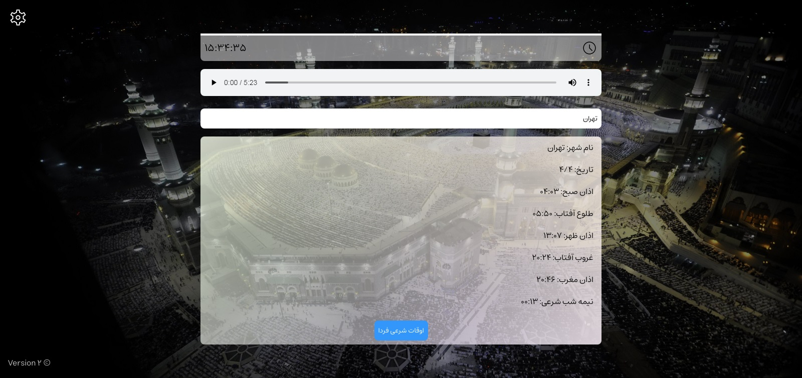

# اپلیکیشن اوقات شرعی
 
[مشاهده صفحه](https://sagharizadeh.github.io/religious-times/) 
با تشکر از [وب سرویس اوقات شرعی کیبیت](https://keybit.ir/brain/%d9%88%d8%a8-%d8%b3%d8%b1%d9%88%db%8c%d8%b3-%d8%af%d8%b1%db%8c%d8%a7%d9%81%d8%aa-%d8%a7%d9%88%d9%82%d8%a7%d8%aa-%d8%b4%d8%b1%d8%b9%db%8c/) 

## نحوه استفاده
برای مشاهده اوقات شرعی شهر خود، نام شهر را در قسمت "نام شهر" وارد کرده و اینتر را بزنید. پس از نمایش اوقات شرعی، میتوانید از دکمه "اوقات شرعی فردا" برای دیدن اوقات شرعی روز بعد استفاده کنید. 
با استفاده از دکمه تنظیمات در بالا سمت چپ میتوانید عکس پس زمینه و موذن را تغییر دهید.
